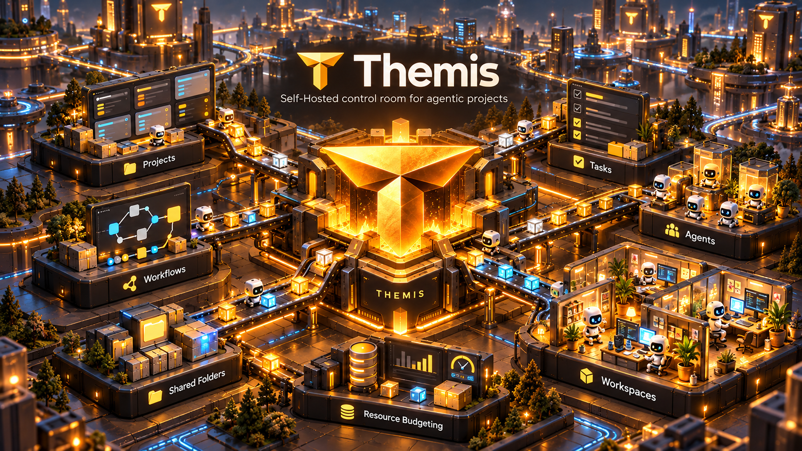

# ThemisForge



**Put your agents to work. Give them a project, a schedule, and room to get things done.**

ThemisForge is a self-hosted workspace for running AI agents around the clock. Organise the work you want done, give each agent its instructions, and let tasks and visual workflows handle the routine. Come back to see what ran, what it produced, and what needs your attention.

Run it on a machine you own and manage everything from your browser. Work keeps running when you close the tab.

**Connect your Codex account to power agent runs with your existing subscription.** Codex is the supported harness today; Claude and OpenRouter integrations are not available yet.

> **Screenshot placeholder:** Project overview and task board.

## What you can do

- **Keep work organised.** Give each project its own agents, tasks, workflows, and shared files. View tasks on a board, in a list, or on a schedule timeline.
- **Automate recurring jobs.** Run a task now, at a chosen time, or on a repeating schedule.
- **Build a team of agents.** Configure their roles, instructions, models, and access to project folders.
- **Connect work visually.** Draw workflows that hand results between agents, run tasks, and branch on outcomes.
- **Keep useful output.** Share files across runs and review the logs and results of every attempt.
- **Stay in control.** Cancel running work, set resource limits, and choose which folders agents can read or change.

Use it for a morning research brief, recurring checks on a codebase, or a workflow where one agent drafts and another reviews. You decide the work and how often it should happen.

> **Screenshot placeholder:** Workflow editor and a completed run.

## Agent isolation and budgets

Each agent attempt runs inside a fresh Docker container called a **cell**, with a private working folder. You choose which shared folders it can access and whether it may write to them. Host folders must be approved by an administrator before they can be mounted. The container is removed when the run ends.

Cells have CPU, memory, and execution time limits. A shared **resource budget** controls how much CPU and memory all running cells can use together, so scheduled work waits when capacity is full. This is a hardware budget; AI spending limits are not implemented yet, and runs still consume your provider's allowance.

The container provides the execution boundary; the agent's own approval prompts and sandbox are disabled inside it. Treat tasks and container images as trusted, and grant folder access deliberately. Docker isolation does not make arbitrary agent work risk-free.

## Installation

On a **Debian or Ubuntu** machine, as a normal user with `sudo` access:

```bash
git clone https://github.com/RT-codes/ThemisForge.git
cd ThemisForge
./themis install
```

The installer installs missing Docker, uv, and Node.js dependencies, builds the app, generates your secret key, and sets up a systemd service that starts on boot.

Open **http://127.0.0.1:8000** on that machine and create your administrator account.

For Codex execution, install the **Codex CLI on the server** and build the agent image from the repository root:

```bash
./themis build-images
```

The host Codex CLI is required for connecting your account and is not installed by the application installer. The in-app guide explains account connection and configuration.

To inspect the installer before running it, use `./themis install --dry-run`. For installation options, use `./themis install --help`.

**Installing on a remote server?** The default address is local to that server. Follow the [deployment guide](docs/08-operations.md#exposing-themisforge-safely) to configure access through HTTPS or a trusted private network.

## Your next step is in the app

**Open Docs in ThemisForge, or visit `/docs` on your installation.** No sign-in is required to read it.

The built-in guide walks you through getting started from scratch: creating your account and project, connecting Codex, configuring agents, running your first task, and scheduling work. It also covers workflows, shared folders, resource settings, and troubleshooting, with search to help you find what you need.

On a default local installation: **http://localhost:8000/docs**.

You can also browse the [documentation sources](docs/) and [roadmap](docs/11-roadmap.md) here on GitHub. ThemisForge is under active development.
